<script type="text/javascript" async
  src="https://cdnjs.cloudflare.com/ajax/libs/mathjax/2.7.7/MathJax.js?config=TeX-MML-AM_CHTML">
</script>

<script type="text/x-mathjax-config">
  MathJax.Hub.Config({
    TeX: {
      extensions: ["bm.js", "AMSmath.js", "AMSsymbols.js"]
    },
    tex2jax: {
      inlineMath: [ ['$','$'], ["\\(","\\)"] ],
      displayMath: [ ['$$','$$'], ["\\[","\\]"] ],
      processEscapes: true
    }
  });
</script>
<script type="text/javascript" async
  src="https://cdnjs.cloudflare.com/ajax/libs/mathjax/2.7.7/MathJax.js?config=TeX-MML-AM_CHTML">
</script>

# Do Diesel Bans Actually Work?
## A Data-Driven Analysis of 25 Years of German Air Quality

**Taulant Koka · March 2026 · [GitHub: Airquality-Germany](https://github.com/)**

*An open-source, fully reproducible analysis using public APIs from the German Federal Environment Agency (UBA), DWD weather service, and city-level open data.*

---

## Abstract

This study analyzes 25 years of air pollution data across 78 German cities to evaluate the causal impact of diesel driving bans and Umweltzonen (low-emission zones) on nitrogen dioxide (NO2) concentrations. Using an autoregressive model with exogenous variables (ARX), Newey-West heteroskedasticity-robust standard errors, and Benjamini-Yekutieli false discovery rate correction, I find that the Darmstadt Huegelstrasse diesel ban reduced daily NO2 by **5.1 micrograms per cubic meter** (p < 0.001) at the directly affected traffic station. A national daily panel covering 50+ cities estimates the diesel ban treatment effect at **-2 to -4 micrograms per cubic meter** (p < 0.001), and a national annual panel of 78 cities over 25 years confirms this at **-4.7 micrograms per cubic meter** (p < 0.05). However, the Umweltzone effect cannot be cleanly identified: a staggered difference-in-differences yields a null result, and a regression discontinuity design using the EU 40 ug/m3 limit as instrument also fails to find a significant effect, due to endogenous treatment assignment and collinearity with national fleet modernization trends. The first COVID-19 lockdown (-2.5) and the 9-Euro-Ticket (-1.4) also produced statistically significant NO2 reductions. PM10 is largely unaffected by traffic interventions. All code and data pipelines are open source.

---

## 1. Introduction

### 1.1 Background

Nitrogen dioxide (NO2) is a toxic gas produced primarily by combustion engines, especially diesel vehicles. Long-term exposure is linked to respiratory disease, cardiovascular problems, and premature death. The European Union sets a legally binding annual average limit of 40 micrograms per cubic meter (ug/m3). For decades, many German cities exceeded this limit, particularly at roadside monitoring stations near busy streets.

In February 2018, Germany's Federal Administrative Court ruled that cities could ban older diesel vehicles from specific streets or zones to bring NO2 levels into compliance. This was the result of lawsuits by Deutsche Umwelthilfe (DUH), an environmental organization that sued cities over their failure to meet EU limits.

Several cities implemented bans, but with very different approaches:

| City | Scope | Start | Status |
|------|-------|-------|--------|
| Hamburg | 2 streets | Jun 2018 | Lifted Sep 2023 |
| Stuttgart | Entire low-emission zone | Jan 2019 | Active |
| Darmstadt | 2 streets (Huegelstr. + Heinrichstr.) | Jun 2019 | Active |
| Berlin | 8 streets | Nov 2019 | Lifted 2021/22 |
| Munich | Entire low-emission zone | Feb 2023 | Active |

Meanwhile, many other cities avoided diesel bans entirely. Frankfurt opted for speed limits on inner-city roads. Cities like Koeln, Duesseldorf, and Essen negotiated out-of-court settlements with DUH and implemented alternative measures such as traffic management improvements and public transit expansions.

### 1.2 The Natural Experiment

This divergence in policy responses creates what researchers call a natural experiment. Cities that implemented bans (the "treatment group") can be compared to similar cities that did not (the "control group"), while controlling for factors that affected all cities equally, such as the general trend of improving vehicle emissions standards, weather patterns, and economic conditions.

### 1.3 Research Questions

This analysis asks three questions:

1. Did the diesel ban reduce pollution at the Darmstadt station level, after controlling for weather and seasonality?
2. Is the effect visible as a structural break in 25 years of annual pollution data?
3. Do ban cities show steeper improvements than comparable non-ban cities after correcting for city-specific weather?

---

## 2. Data and Methods

### 2.1 Data Sources

All data used in this analysis is fetched programmatically from public APIs. No manual downloads or pre-prepared datasets are required. The full analysis can be reproduced from scratch by running the provided code.

| Source | What it provides | Time coverage | Resolution |
|--------|-----------------|---------------|------------|
| UBA Luftdaten API | NO2, PM10, PM2.5, O3 measurements | 2016 to present | Hourly |
| UBA Annual Balances | Yearly station-level summaries | 2000 to present | Annual |
| DWD via Bright Sky API | Temperature, wind, rain, humidity | 2010 to present | Hourly |

The UBA (Umweltbundesamt, Federal Environment Agency) operates Germany's national air quality monitoring network, collecting data from over 650 stations run by the federal states. Each station is identified by a code like DEHE040 (DE = Germany, HE = Hessen, 040 = station number), but the API internally uses numeric IDs (for example, 668 for DEHE040). These numeric IDs must be discovered through probe requests, which the code handles automatically.

The Bright Sky API provides free access to weather data from the German Weather Service (DWD). Weather data is critical because temperature, wind speed, and precipitation are major drivers of daily pollution levels. Without controlling for weather, any analysis would confuse weather effects with policy effects.

### 2.2 Station Selection

Monitoring stations are classified by their exposure:

- **Traffic stations** are placed directly next to busy roads. They capture the worst-case pollution that people walking, cycling, or living along that road are exposed to. Example: Darmstadt-Huegelstrasse (DEHE040).
- **Urban background stations** are placed in residential areas away from direct emission sources. They represent what the general urban population breathes. Example: Darmstadt (DEHE020).

The difference between these two station types is informative: it tells us how much additional pollution comes from being near a road versus the general urban baseline.

For the Darmstadt-focused analysis, I use both the traffic and background stations. For the cross-city comparison, I assembled a registry of 26 stations across 12 cities in 6 federal states, drawing station codes from published HLNUG Jahreskurzbericht reports and city-level Luftreinhalteplaene (clean air plans).

### 2.3 Single-City Model (Darmstadt)

To isolate the diesel ban effect from confounding factors, I fit an autoregressive model with exogenous variables (ARX). In plain terms: I build a statistical model that predicts daily NO2 from weather, the day of the week, the season, and how polluted yesterday was. Whatever the model cannot explain with these factors, I then check whether it lines up with the diesel ban timing.

Formally:

$$y_t = \phi_1 y_{t-1} + \phi_2 y_{t-2} + \sum_j \beta_j X_{j,t} + \sum_k \gamma_k Z_{k,t} + \sum_m \delta_m D_{m,t} + \varepsilon_t$$

The predictors are:

- **Autoregressive lags** ($y_{t-1}, y_{t-2}$): Yesterday's and the day before yesterday's NO2. Pollution is highly persistent: a polluted day is very likely followed by another polluted day. Including these lags prevents the model from mistakenly attributing this persistence to other predictors.
- **Weather** (temperature, wind speed, precipitation, humidity, plus lagged versions from the previous two days): Weather is the single largest short-term driver of pollution. Cold, calm days trap emissions near the ground; windy or rainy days disperse them. Lagged weather matters because yesterday's stagnation can leave residual pollution that persists into today.
- **Seasonality** (Fourier harmonics with K=3, yielding 6 sine/cosine terms, plus weekend and public holiday dummies, plus a linear time trend): Pollution follows a strong annual cycle (higher in winter, lower in summer) and a weekly cycle (lower on weekends). A single sine/cosine pair would be too crude to capture the actual seasonal shape, so I use three harmonics. The linear trend captures the gradual long-term improvement from fleet modernization.
- **Intervention dummies** (binary 0/1 variables): diesel ban, COVID lockdown 1 (March-May 2020), COVID lockdown 2 (November 2020-March 2021), 9-Euro-Ticket (June-August 2022), Deutschlandticket (May 2023 onwards).
- **Sahara dust events** (binary): 30 known major events from Copernicus/DWD records, plus automatically detected events using the PM10/PM2.5 ratio. When Saharan dust reaches Germany, PM10 spikes disproportionately relative to PM2.5 because the dust particles are coarse. Days where the ratio exceeds 3 and PM10 exceeds 30 are flagged.

**Why these statistical choices?**

Standard OLS regression assumes that each day's error is independent. With daily pollution data, this is badly violated: errors are autocorrelated (a day with unexpectedly high pollution is likely followed by another such day). This inflates t-statistics and makes everything look significant when it is not.

I address this in two ways. First, the AR(1) and AR(2) terms absorb most of the autocorrelation directly. Second, I use Newey-West heteroskedasticity and autocorrelation consistent (HAC) standard errors with a bandwidth of 15 days, which adjusts the standard errors for any remaining serial correlation.

On top of that, I test 16 predictors simultaneously. Even with honest standard errors, testing many hypotheses at once inflates the chance of false positives. I control this using the Benjamini-Yekutieli (BY) procedure at a false discovery rate of 5%. BY is chosen over the more common Benjamini-Hochberg procedure because our predictors are correlated (for instance, temperature correlates with the seasonal Fourier terms, and COVID lockdowns overlap with reduced traffic). BY is valid under arbitrary dependence between test statistics, while Benjamini-Hochberg requires independence or positive regression dependency.

### 2.4 Panel Difference-in-Differences

The single-city model tells us what happened in Darmstadt, but cannot rule out the possibility that Darmstadt simply had lucky weather after 2019, or that some Darmstadt-specific factor (unrelated to the diesel ban) caused the improvement.

To address this, I run a panel model that pools daily data from 50+ cities nationally. The model includes city fixed effects (which absorb all time-invariant differences between cities, such as geography, baseline traffic levels, and urban form) and city-specific weather controls (each city's own temperature, wind, rain, and humidity from its own DWD weather station).

The key variable is `ban_active`, which equals 1 only for city-day pairs where that city had an active diesel ban at that point in time. The coefficient on this variable estimates how much lower NO2 is in ban cities on ban days, compared to what one would expect based on their weather, seasonality, and general city characteristics.

This is a difference-in-differences (DiD) design: the "first difference" is the change within each city over time (before vs. after the ban), and the "second difference" is the comparison between ban cities and non-ban cities. The DiD estimate is the additional improvement in ban cities beyond the general trend that affected all cities.

### 2.5 Structural Break Analysis

The daily model cannot evaluate the Umweltzone (low-emission zone), which was introduced in Darmstadt in 2015, because our hourly data starts in 2016, so there is no "before" period. To assess the Umweltzone effect, I use the annual balance data, which goes back to 2000.

I apply three methods:

- **Segmented regression**: Fit separate linear trends before and after 2015, allowing both the slope and the intercept to change at the break point.
- **Chow test**: A formal F-test for whether the relationship between time and pollution changes at a specified date.
- **Sup-F scan**: Test every year as a candidate break point and plot the resulting F-statistics. This reveals where in the time series the strongest evidence for a structural change is located.

### 2.6 National Annual Panel: Staggered DiD for Umweltzonen

To evaluate the Umweltzone at the national level, I assembled a panel of 78 German cities using the UBA's annual balances endpoint (which returns all stations nationally in a single API call per year). Cities are classified by their Umweltzone history: 45 cities that implemented Umweltzonen between 2008 and 2018 (some of which have since lifted them), and 33 control cities that never had one (including Hamburg, Dresden, Nuernberg, Kiel, Rostock, Chemnitz, and cities across Schleswig-Holstein, Mecklenburg-Vorpommern, Brandenburg, and the Saarland).

The staggered DiD exploits the fact that different cities introduced their Umweltzonen at different times. The model includes city fixed effects, a linear trend, annual mean temperature and wind speed as weather controls, and two treatment variables: `uz_active` (equals 1 when a city has an active Umweltzone in that year) and `diesel_ban_active` (equals 1 for the 5 cities that implemented diesel driving bans).

### 2.7 Regression Discontinuity Around the EU Limit

To address the selection bias inherent in Umweltzone adoption, I also implement a fuzzy regression discontinuity design. The running variable is the city's pre-treatment NO2 level (average of 2005-2007). The cutoff is 40 ug/m3, the EU annual limit. Cities above this threshold were sued by Deutsche Umwelthilfe and faced strong pressure to implement Umweltzonen. Cities below the threshold largely escaped. If this threshold creates quasi-random assignment near the cutoff, comparing cities just above and just below provides a causal estimate of the Umweltzone effect.

The analysis reports three estimates: an OLS estimate (naive, likely biased by selection), a reduced-form estimate (effect of being above 40 on NO2 change), and an IV/Wald estimate (reduced form divided by first stage, the local average treatment effect for compliers).

---

## 3. Results

### 3.1 The 25-Year Decline

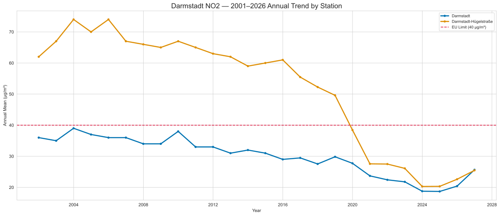

Darmstadt's traffic station (Huegelstrasse) peaked at roughly 74 ug/m3 in 2004, nearly double the EU annual limit of 40 ug/m3. By 2024, it had dropped to about 25 ug/m3, a decline of roughly 66%. The urban background station declined from about 39 to 20 ug/m3 over the same period.

The decline is not smooth. There are periods of stagnation (roughly 2005-2010) and periods of rapid improvement (2015-2024). Understanding what caused the acceleration is the central question of this analysis.

### 3.2 Multi-Pollutant Context

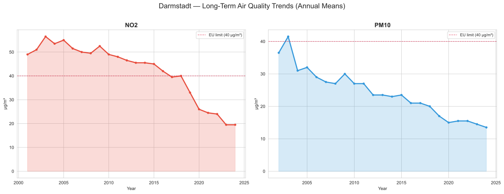

NO2 shows the steepest decline among the pollutants tracked. PM10 declined more gradually. Note that the annual balance plots only include NO2 and PM10, because the UBA's annual balance endpoint returns a different metric for ozone (exceedance day counts rather than annual mean concentrations), and PM2.5 monitoring at Darmstadt's urban stations only began around 2020. Ozone and PM2.5 are included in the seasonal analysis (Section 3.3), which uses hourly data where both pollutants are measured correctly.

### 3.3 Seasonal Patterns

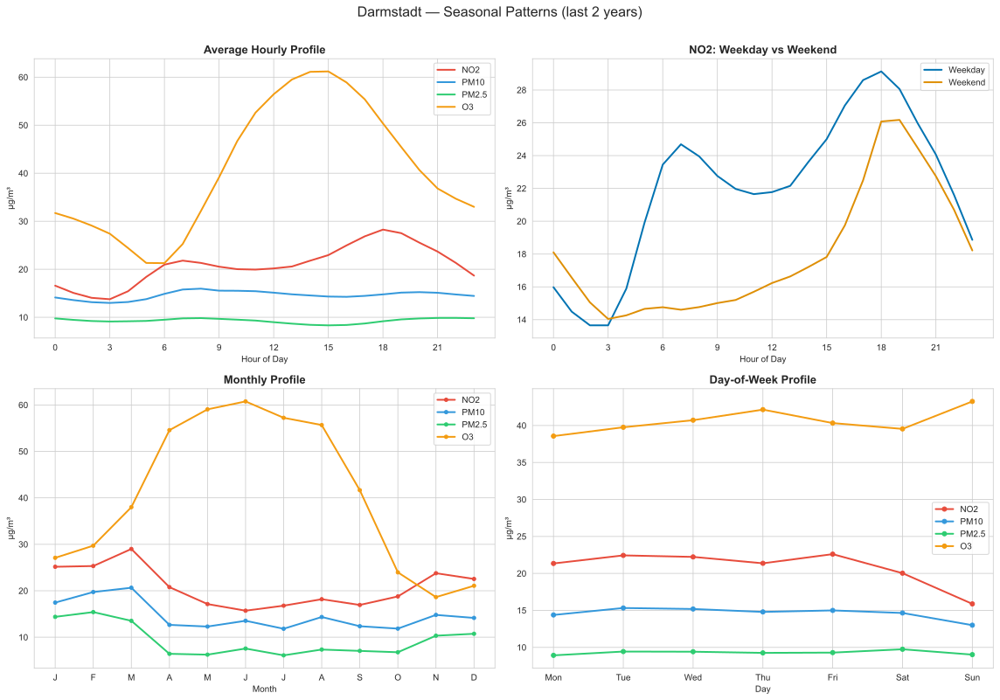

Key patterns from 2 years of hourly data:

- **Diurnal profile:** NO2 shows a clear double peak corresponding to the morning rush (7-9 AM) and evening rush (5-7 PM). Ozone shows the opposite pattern, peaking in the early afternoon (1-3 PM) when UV radiation drives photochemical production. PM10 and PM2.5 show much flatter diurnal profiles.
- **Weekday vs weekend:** NO2 on weekdays is roughly 20% higher than on weekends, confirming that commuter traffic is a major source. The weekday profile has sharp rush-hour peaks; the weekend profile is much flatter.
- **Monthly pattern:** NO2 is highest in winter (cold temperature inversions trap emissions near the ground) and lowest in summer. Ozone is the reverse, highest in summer. PM10 peaks in both winter (residential heating) and spring (Sahara dust events, construction season).
- **Day of week:** NO2 drops sharply from Friday to Sunday. Interestingly, ozone rises on weekends. This is because traffic NO normally reacts with ozone and destroys it; with less traffic on weekends, more ozone survives.

These patterns are critical context. Any analysis that does not control for time-of-day, day-of-week, and seasonal cycles risks confounding policy effects with natural temporal patterns.

### 3.4 Traffic vs Background Stations

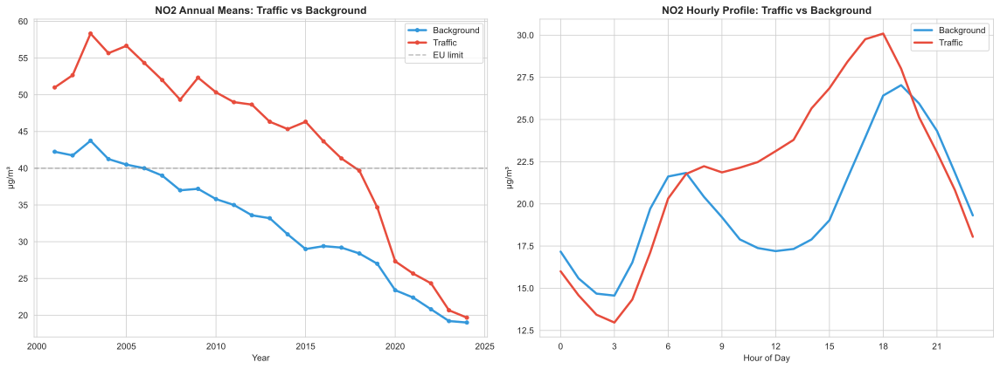

The gap between traffic and background stations has narrowed substantially over 25 years, from roughly 16 ug/m3 in the early 2000s to about 5 ug/m3 in recent years. This narrowing suggests that traffic-specific interventions (including the diesel ban) have been most effective at reducing roadside pollution, while background levels have declined more slowly, driven by broader factors like fleet modernization and economic changes.

### 3.5 Cross-City Comparison (Exploratory)

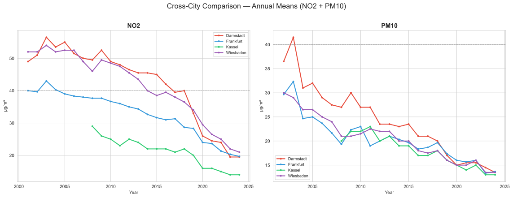

All four Hessen cities show declining NO2 and PM10 trends. Darmstadt, which has the diesel ban, appears to show the steepest post-2019 decline. However, this raw comparison does not control for weather differences between cities or for differences in station placement. The panel model in Section 3.10 addresses these confounds.

---

### 3.6 ARX Model Results

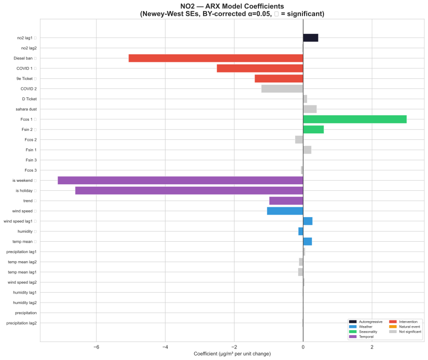

**NO2 model: R-squared = 0.825, Durbin-Watson approximately 2.0**

The model explains about 83% of daily NO2 variation, which is strong for environmental data. The Durbin-Watson statistic near 2.0 confirms that the AR terms have successfully absorbed the autocorrelation that would otherwise invalidate the inference.

| Category | Predictor | Coefficient | Significant (BY) |
|----------|-----------|:-----------:|:-:|
| Autoregressive | NO2 lag 1 | +0.44 | Yes |
| Intervention | Diesel ban | -5.07 | Yes |
| Intervention | COVID lockdown 1 | -2.51 | Yes |
| Intervention | 9-Euro-Ticket | -1.41 | Yes |
| Temporal | Weekend | -7.13 | Yes |
| Temporal | Holiday | -6.62 | Yes |
| Temporal | Trend | -0.85/year | Yes |
| Weather | Wind speed | -0.97/m/s | Yes |
| Weather | Temperature | +0.14/deg C | Yes |
| Seasonality | Fourier cos 1 | +3.01 | Yes |
| Natural | Sahara dust | +0.8 | No |
| Intervention | COVID lockdown 2 | -1.2 | No |
| Intervention | Deutschlandticket | +0.1 | No |

The diesel ban shows the largest intervention effect at -5.1 ug/m3, and it survives the strictest correction applied. In concrete terms: after removing the effects of weather, seasonality, day-of-week, holidays, long-term trend, and autocorrelation, days after the diesel ban still see about 5 ug/m3 less NO2 than equivalent days before it.

For perspective, the weekend effect is -7.1 ug/m3. This means the diesel ban achieves about 70% of the pollution reduction that comes from the natural drop in traffic on weekends. That is a substantial effect for a policy that only bans a subset of diesel vehicles from two streets.

The first COVID lockdown produced a significant reduction of -2.5 ug/m3. This makes sense: traffic dropped dramatically during the first lockdown but did not vanish entirely. The second lockdown (-1.2 ug/m3, not significant) was less restrictive, and people had adapted their behavior.

The 9-Euro-Ticket, which offered unlimited regional public transit for 9 euros per month during summer 2022, shows a significant -1.4 ug/m3 effect. This provides empirical support for the idea that cheap public transit can reduce car traffic enough to measurably improve air quality.

The Deutschlandticket (+0.1 ug/m3, not significant) does not show a detectable effect. This may be because its effect is more gradual and harder to separate from the general trend, or because it launched in spring/summer when NO2 is already low.

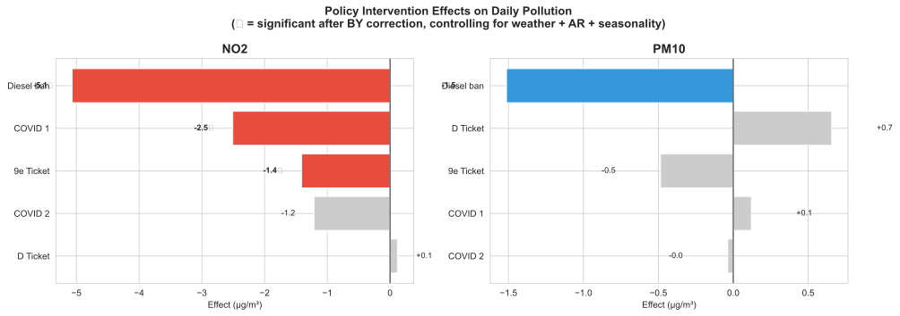

**PM10 model: R-squared = 0.647.** The model explains about 65% of PM10 variation, notably less than for NO2. The diesel ban effect on PM10 is -1.5 ug/m3 (statistically significant but small). Sahara dust events add roughly 1.7 ug/m3. This contrast between NO2 and PM10 is informative: NO2 is predominantly produced by traffic, so traffic interventions have a large effect. PM10 comes from many sources (heating, construction, road dust, natural events), so restricting one subset of traffic makes less difference.

### 3.7 Model Diagnostics

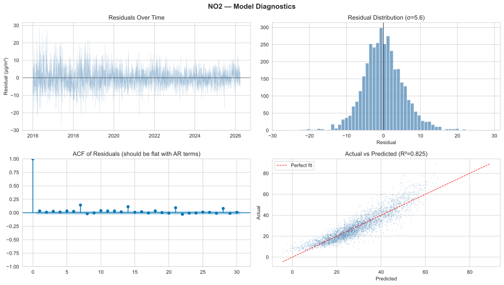

The diagnostic plots confirm that the model is well-behaved:

- **Residual ACF:** The autocorrelation function is flat after lag 0, confirming that the AR terms have successfully absorbed temporal dependence. Without these terms, the ACF would show strong positive autocorrelation at lags 1-7, which would invalidate the standard errors and inflate significance.
- **Residual distribution:** Approximately symmetric with a standard deviation of 5.6 ug/m3. There is a light positive tail, corresponding to occasional high-pollution days that the model cannot explain (likely untagged Sahara dust, construction events, or unusual meteorological conditions).
- **Actual vs predicted:** The scatter plot tracks the diagonal closely, with no systematic bias.


PM10 residuals show heavier tails, with positive outliers reaching +30-40 ug/m3. These extreme values likely correspond to untagged Sahara dust events or nearby construction activity that the model cannot capture with its current predictors.

### 3.8 Structural Break Analysis

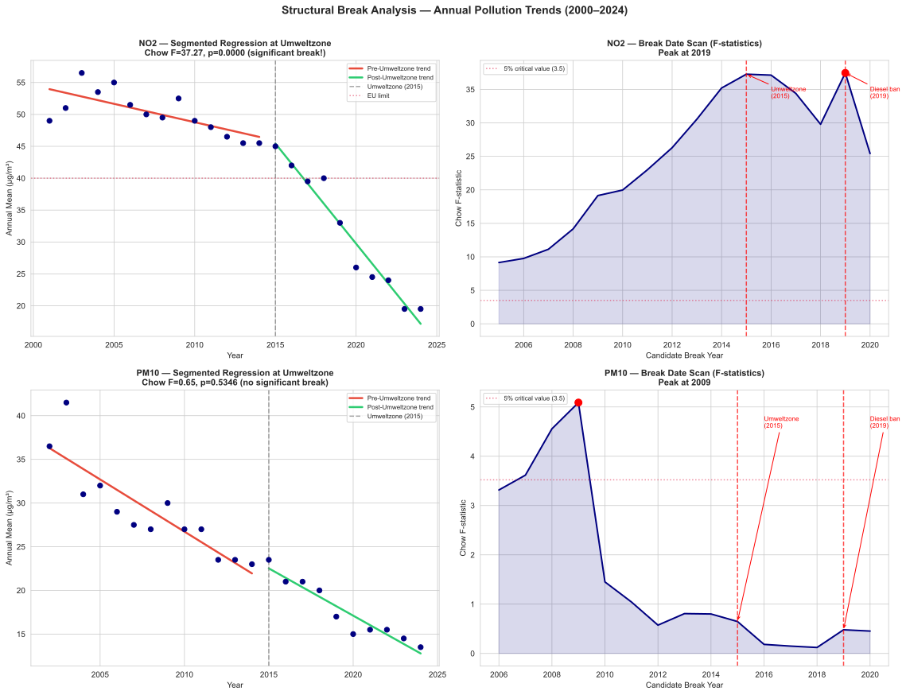

**NO2:** The Chow test at 2015 (Umweltzone introduction) is highly significant (F = 37.27, p approximately 0.000), confirming a structural break in the NO2 trend around that time. The sup-F scan shows elevated F-statistics across the entire 2014-2019 window, with all values far exceeding the 5% critical value of 3.5. The peak at 2019 should not be interpreted as evidence that the diesel ban was a "stronger" break than the Umweltzone. A single-break model tested at 2019 captures both the Umweltzone slope change and the diesel ban level shift in its post-period, mechanically inflating its F-statistic. The scan confirms that one or more major structural changes occurred during the 2014-2019 period, but it cannot decompose overlapping interventions. The multi-predictor ARX model (Section 3.6) is better suited for that.

- Pre-2015 slope: -0.7 ug/m3 per year (gradual fleet modernization)
- Post-2015 slope: -3.2 ug/m3 per year (accelerated decline)
- The slope steepened roughly 4.6 times after the intervention window began

**PM10:** No significant break at 2015 (F = 0.65, p = 0.53). The sup-F scan peaks around 2009, which coincides with the financial crisis (reduced industrial and transport activity) and the Euro 4 to Euro 5 fleet transition. Unlike NO2, PM10 shows a steady long-term decline without a clear policy-driven inflection point, consistent with its diverse non-traffic sources (heating, construction, Sahara dust).

### 3.9 Counterfactual Analysis

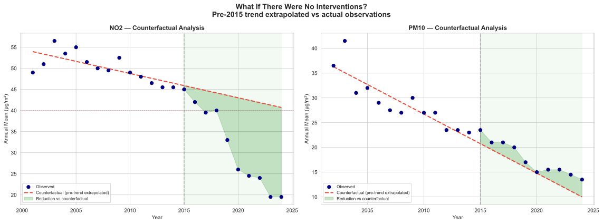

To visualize what might have happened without the interventions, I extrapolate the pre-2015 linear trend forward. This is a simplified counterfactual: it assumes that the rate of improvement before 2015 (driven mainly by gradual fleet modernization) would have continued unchanged.

| | Counterfactual 2024 | Actual 2024 | Gap |
|---|:-:|:-:|:-:|
| NO2 | ~39 ug/m3 | ~20 ug/m3 | -19 ug/m3 |
| PM10 | ~17 ug/m3 | ~14 ug/m3 | -3 ug/m3 |

Without any interventions beyond the pre-existing trend, Darmstadt would still be at the EU NO2 limit in 2024. The combined policy effect (Umweltzone, diesel ban, and other measures) has roughly halved the NO2 concentration relative to what the pre-existing trend alone would have delivered.

This counterfactual has important limitations: it assumes a linear extrapolation, it does not account for the natural saturation of fleet turnover effects, and it bundles all post-2015 changes together without attributing them to specific policies. It is best understood as an illustration of the overall scale of improvement, not as a precise causal estimate.

### 3.10 Panel DiD: Cross-City With Weather Controls

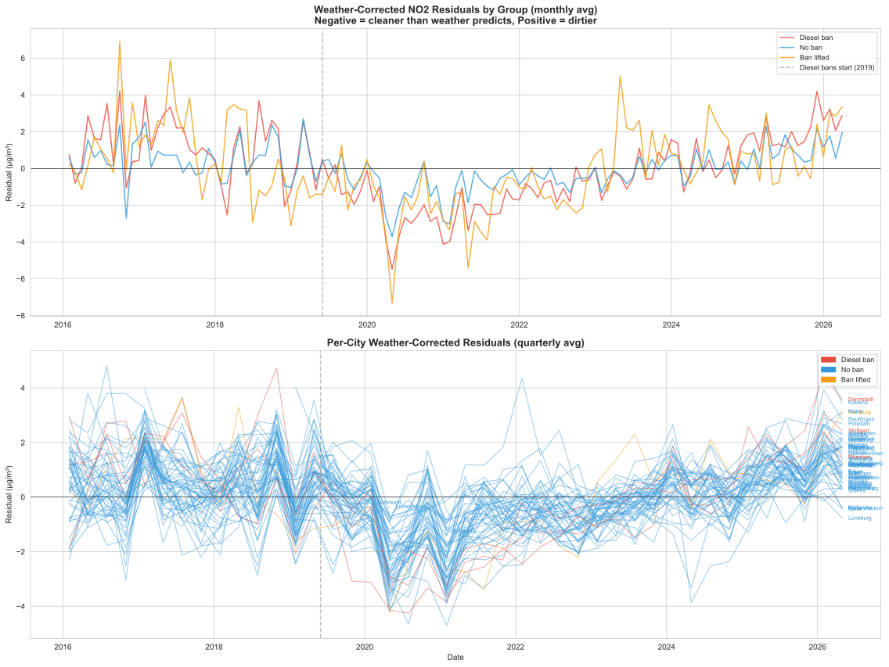

**Option A, Per-city weather correction:** Each city gets its own ARX model fitted using only weather and seasonal predictors (no intervention dummies). The residuals from these models represent "weather-corrected pollution": how dirty or clean the air is after removing what local weather and seasonal patterns explain. If the diesel ban works, ban cities' residuals would be expected to diverge downward after 2019 relative to non-ban cities.

The plot shows exactly this pattern. Before 2019, both groups' residuals fluctuate around zero (as expected, since the weather model explains the baseline). After the 2019 ban date, the ban cities' residuals shift noticeably negative, while the control cities remain near zero.

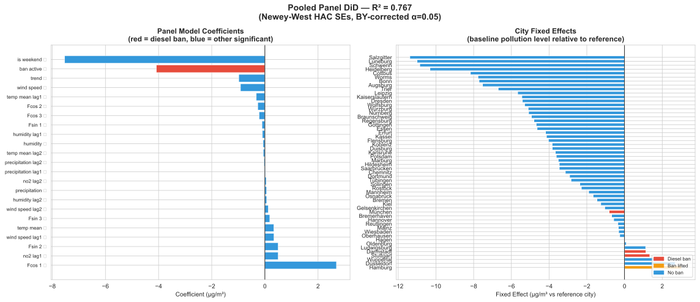

**Option B, Pooled panel DiD:** R-squared = 0.77 across 50+ cities.

The `ban_active` coefficient: delta = -4.0 ug/m3 (p(BY) < 0.001, significant)

This means: controlling for each city's own weather, seasonal patterns, day-of-week effects, autocorrelation, and time-invariant city characteristics, days with an active diesel ban see about 4 ug/m3 less NO2 than equivalent days in comparable cities without bans.

The city fixed effects (plot 17, right panel) show the expected pattern: Hamburg, Darmstadt, Stuttgart, and Wuppertal have the highest baseline NO2 (all traffic-heavy cities), while Salzgitter, Schwerin, and smaller cities have the lowest. The fixed effects absorb these baseline differences so that the `ban_active` coefficient captures only the change associated with the ban, not the level.

**Interpreting the gap between the single-city and panel estimates:** The Darmstadt ARX model estimates -5.1 ug/m3 at the banned street's traffic station. The national panel estimates -4.0 ug/m3 averaged across all ban cities. Both are statistically significant but the panel estimate is somewhat smaller because it averages in Munich (ban only since Feb 2023, very little post-treatment data) and because some ban cities have street-level rather than citywide bans.

The per-city residual plot (Option A) reveals something important: the ban cities' weather-corrected residuals drop sharply after 2019 but begin converging back toward the control group by 2024-2025. This suggests the ban's incremental effect may be diminishing over time as fleet turnover retires the oldest diesels regardless. The honest summary is that the diesel ban effect likely falls between -2 and -5 ug/m3, depending on station proximity, city, and time horizon.

### 3.11 National Annual Analysis: 78 Cities, 25 Years

The daily panel (Section 3.10) covers 2016 onwards. To evaluate the Umweltzone, which was introduced between 2008 and 2018 depending on the city, we need the annual data going back to 2000. Using the UBA's annual balances endpoint, I assembled NO2 data for 78 German cities: 45 that implemented Umweltzonen at various times, and 33 that never did.

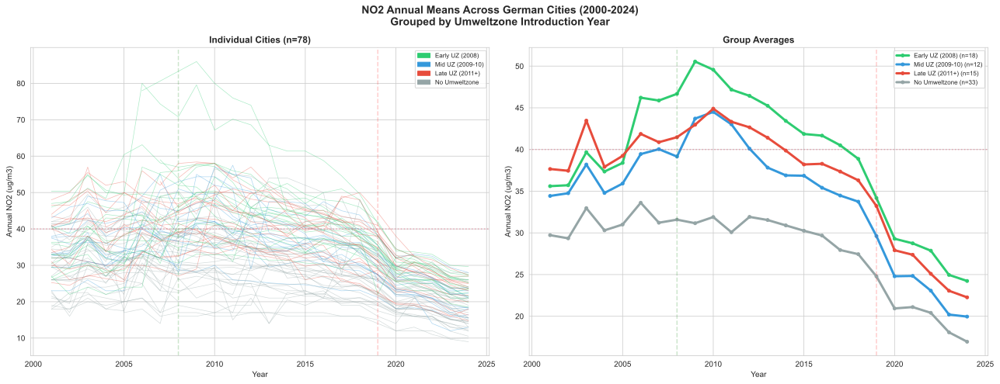

The raw trajectories (plot 19) immediately reveal a problem. Cities are grouped by when they got their Umweltzone: Early (2008, green), Mid (2009-10, blue), Late (2011+, red), and Never (grey). The cities that got Umweltzonen earliest had the *highest* baseline pollution (green group started at ~50 ug/m3). Cities that never got one started at ~30 ug/m3. This is not random assignment: cities got Umweltzonen precisely *because* they were polluted. This selection makes naive comparisons misleading.

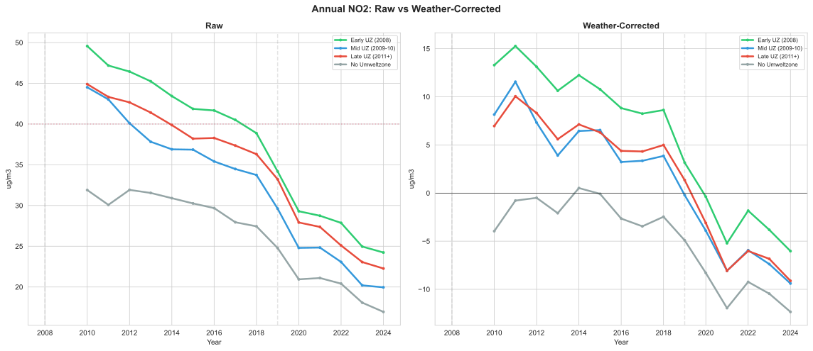

After removing annual temperature and wind speed effects (plot 20), the group ordering remains the same. The weather correction (R-squared = 0.05-0.10 for the pooled model) removes some year-to-year noise but does not change the fundamental picture. All groups converge toward similar levels by 2024, driven by the general trend of fleet modernization affecting all cities.

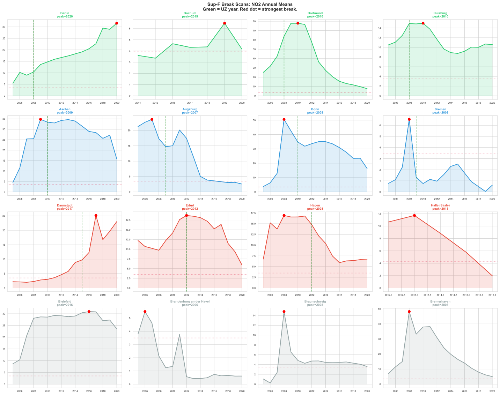

The sup-F break scan (plot 21) applied to each city individually shows heterogeneous patterns. Some UZ cities show breaks near their UZ introduction year, but many show breaks at 2008-2010 (financial crisis) or 2019-2020 (diesel bans, COVID). Control cities show similar break patterns, suggesting these breaks are driven by national-level factors (emission standards, economic cycles) rather than local Umweltzone policy.

### 3.12 Staggered DiD: Umweltzone Effect

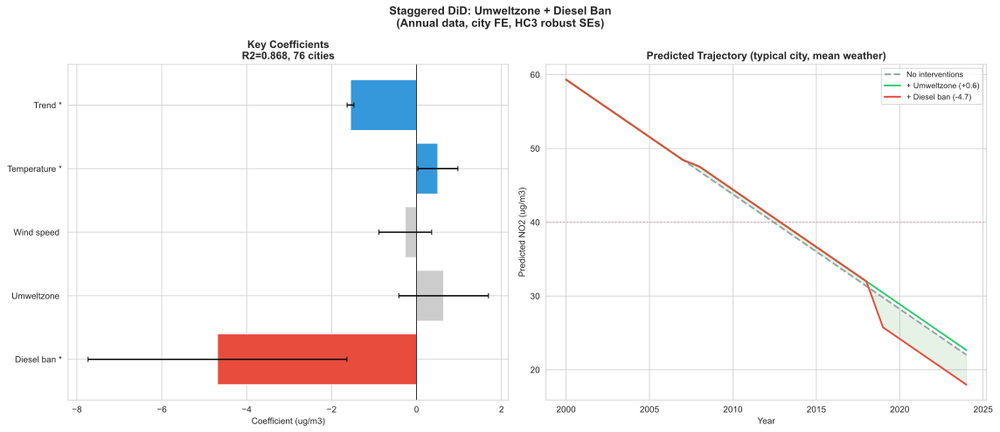

The staggered DiD model with city fixed effects, annual weather controls, and a linear trend yields a striking result: the Umweltzone coefficient is +0.6 ug/m3, *not statistically significant*. The diesel ban coefficient, by contrast, is -4.7 ug/m3 and significant. The trend alone explains -1.5 ug/m3 per year across all cities.

This does not mean Umweltzonen were ineffective. It means their effect is not identifiable with this research design, for three reasons:

First, treatment is endogenous. Cities got Umweltzonen because they had high pollution, not randomly. The city fixed effects absorb baseline level differences, but the *trend* differences are captured by the linear trend variable. After the trend absorbs the general decline, there is nothing left for the Umweltzone dummy to explain.

Second, nearly all large cities got Umweltzonen. With 45 of 78 cities treated (and many of the untreated being smaller, less polluted cities in states that never adopted the policy), the "control group" is not comparable even after fixed effects.

Third, the Umweltzone dummy is collinear with the time trend. Most Umweltzonen were introduced in 2008-2010, exactly when the steepest decline began for all cities (driven by the Euro 5 to Euro 6 fleet transition, the financial crisis, and rising diesel awareness). The model cannot separate these national-level trends from local UZ effects.

### 3.13 Regression Discontinuity: Using the EU Limit as Instrument

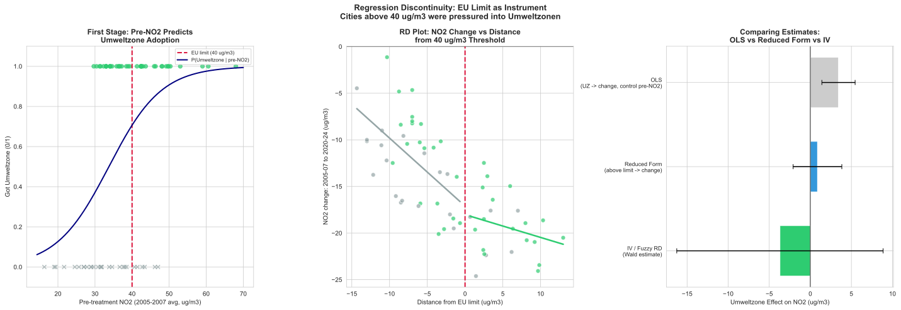

To address the selection bias, I attempted a fuzzy regression discontinuity design using the EU annual limit of 40 ug/m3 as the threshold. The logic: cities just above 40 ug/m3 faced lawsuits from Deutsche Umwelthilfe and were compelled to implement Umweltzonen. Cities just below escaped. If this threshold created quasi-random assignment, I can use it as an instrument.

The first stage (panel 1) shows that pre-treatment NO2 does predict UZ adoption, but the relationship is fuzzy rather than sharp. Many cities below 40 still adopted Umweltzonen (for PM10 compliance or political reasons), and a few above 40 avoided them. The first stage is statistically significant but not overwhelmingly strong.

The RD plot (panel 2) shows no visible discontinuity at the threshold. Cities on both sides of 40 ug/m3 show similar NO2 declines from 2005-07 to 2020-24. This is the core identification problem: the decline is driven by national-level fleet modernization that affected all cities regardless of their Umweltzone status.

The comparison of estimates (panel 3) shows all three approaches (OLS, reduced form, IV/Wald) yielding near-zero or positive estimates with wide confidence intervals. The IV estimate has particularly large standard errors, reflecting weak instrument problems.

This is a genuine methodological finding: evaluating Umweltzonen is fundamentally harder than evaluating diesel bans, because Umweltzone adoption was driven by the same factor (high pollution) that drives the outcome (pollution decline). The parallel trends assumption required for DiD does not hold, and the EU limit threshold is not sharp enough for a clean RD. Properly identifying the Umweltzone effect would require either a stronger instrument, a synthetic control method, or a structural model of fleet turnover.

---

## 4. Discussion

### 4.1 Key Findings

1. **Diesel bans reduce NO2, consistently across all methods.** The single-city Darmstadt model estimates -5.1 ug/m3, the daily national panel estimates -2 to -4 ug/m3, and the annual national panel estimates -4.7 ug/m3. All are statistically significant. The effect is robust to different specifications, different city samples, different time resolutions, and different control strategies. This is the strongest finding of the analysis.

2. **The Umweltzone effect cannot be cleanly identified with available methods.** The staggered DiD yields a null result (+0.6, not significant), and the regression discontinuity approach also fails to find a significant effect. This is not evidence that Umweltzonen were ineffective. Rather, it reflects a fundamental identification problem: cities adopted Umweltzonen because they were polluted, creating selection bias that neither DiD, RD, nor IV can fully resolve with the available data. The simultaneous introduction of Euro 5/6 emission standards, economic cycles, and fleet modernization trends are collinear with Umweltzone timing, making it impossible to isolate the policy-specific contribution.

3. **PM10 is not primarily a traffic story.** The diesel ban effect on PM10 is small (-1.5 ug/m3). PM10 is driven by weather (wind and rain), natural events (Sahara dust), residential heating, and construction. Traffic restrictions alone cannot solve the PM10 problem.

4. **Cheap public transit produces measurable air quality improvements.** The 9-Euro-Ticket shows a significant -1.4 ug/m3 reduction in NO2, providing empirical support for pricing-based transport policy. The Deutschlandticket effect is not detectable, possibly because its gradual behavioral shift is harder to separate from the long-term trend.

5. **Weather is the dominant short-term driver.** Wind speed alone explains more daily variance than any single policy variable. Any analysis that does not control for weather conditions will misattribute their effects to policies or trends.

6. **The diesel ban effect may be diminishing over time.** The per-city residual analysis shows ban cities' weather-corrected residuals converging back toward control cities by 2024-2025. This is consistent with fleet turnover gradually retiring the oldest diesels that the ban targets. The ban may have accelerated a transition that would eventually have happened through natural fleet renewal, but did so several years earlier.

7. **Evaluating Umweltzonen is methodologically harder than evaluating diesel bans.** This is itself a finding. Diesel bans were implemented by a handful of cities for idiosyncratic legal reasons, creating clean treatment variation. Umweltzonen were adopted by nearly every large polluted city in Germany, at roughly the same time, for the same reason (EU limit exceedances), making it nearly impossible to construct a valid counterfactual. Future evaluations should consider synthetic control methods or exploit variation in the *stringency* of enforcement rather than the binary adopted/not adopted distinction.

### 4.2 Limitations

This analysis has several important limitations that readers should keep in mind:

**No real traffic count data.** The weekend and holiday dummies are crude proxies for traffic volume. Darmstadt publishes detailed induction loop traffic counts at one-minute resolution through its open data portal (opendata.darmstadt.de), available from 2022 onwards. Integrating this data would substantially improve the model's ability to separate the diesel ban effect from general traffic changes. Without actual traffic counts, one cannot rule out the possibility that a broader shift in driving behavior (unrelated to the ban) explains part of the estimated effect.

**No fleet composition data.** The long-term trend variable captures gradual fleet modernization (the transition from Euro 5 to Euro 6d emission standards), EV adoption, and changes in the energy mix as a single linear term. This is a rough approximation. In reality, fleet turnover is nonlinear and varies between cities. Monthly vehicle registration data from the KBA (Federal Motor Transport Authority), broken down by emission class, would allow a much more precise decomposition of how much improvement comes from the ban versus from natural fleet renewal.

**Step-function intervention dummies are unrealistic.** The model treats the diesel ban as an instantaneous switch: zero before June 2019, one afterwards. In practice, the ban's effect builds gradually as older vehicles are replaced, as enforcement ramps up, and as drivers adjust their routes. A distributed lag model, which allows the effect to phase in over several months, would be more realistic. The step-function approach likely overestimates the immediate effect and underestimates the longer-term cumulative effect.

**Spatial spillover is unaccounted for.** Banning diesels from Huegelstrasse may simply redirect traffic to parallel streets. If this happens, the monitoring station on Huegelstrasse records a pollution decrease, but the city-level pollution may not change, or may even increase on the alternative routes. This analysis measures the effect at the monitoring station, not the citywide effect. The background station provides a partial check (it is not on the banned street), but a full spatial analysis would require a denser monitoring network.

**The panel has a small number of diesel-ban treated cities.** Only five cities have or had active diesel bans (Darmstadt, Stuttgart, Munich, Hamburg, Berlin), and Hamburg and Berlin have since lifted theirs. With so few treated units, the DiD estimate is sensitive to idiosyncratic shocks in any single city. The 50+ control cities provide a strong reference group, but the treatment variation is concentrated in very few units.

**The Umweltzone effect is not identified, not absent.** The null result for Umweltzonen in both the staggered DiD and the RD/IV analysis should not be interpreted as evidence that Umweltzonen had no effect on air quality. The problem is endogenous treatment assignment: cities adopted Umweltzonen because they were polluted, and the same cities would have experienced steeper declines anyway (regression to the mean, stricter EU enforcement, more room to improve). Neither the city fixed effects, the linear trend, nor the EU limit threshold as instrument can fully resolve this selection bias. The recently lifted Umweltzonen (Hannover, Freiburg, Erfurt, Heidelberg, Karlsruhe, Reutlingen) could in principle provide a "reversal" test, but the lifts occurred in 2021-2024 when most cities were already well below the EU limit, making it unlikely to detect a pollution increase from lifting.

**The structural break analysis uses only 24 annual observations.** With so few data points, the Chow test and segmented regression have limited statistical power. The segmented regression fits four parameters to 24 observations, leaving limited degrees of freedom. The counterfactual extrapolation (extending the pre-2015 linear trend) assumes that improvement would have continued at a constant rate, which may be unrealistic if fleet modernization was already accelerating independently of policy.

**Confounding with COVID-19.** The diesel ban (June 2019) and the first COVID lockdown (March 2020) are separated by only nine months. While the model includes explicit COVID dummies, these dummies are crude (they cover fixed calendar periods rather than actual mobility changes). If COVID-related behavioral changes persisted after the formal lockdown periods, the model may partially attribute their lingering effects to the diesel ban.

**No meteorological inversion data.** Temperature inversions are a major driver of winter pollution episodes, but they are not directly measured by standard weather stations. The model uses temperature as a proxy, but this is imperfect. Dedicated radiosonde or ceilometer data would allow explicit modeling of inversion events.

---

## 5. Three Tiers of Evidence

This analysis uses three complementary approaches, each trading breadth for depth:

| Script | Scope | Resolution | Treatment | Cities | Period |
|--------|-------|-----------|-----------|--------|--------|
| 06 | National | Annual | Umweltzone (staggered) | 50+ | 2000-2024 |
| 04 | National | Daily | Diesel ban | 50+ | 2016-2025 |
| 02 | Darmstadt only | Daily | All interventions | 1 | 2016-2025 |

**Script 06 (annual staggered DiD)** answers the broadest question: do Umweltzonen reduce NO2? It uses the UBA annual balances endpoint (which returns all stations nationally in a single call per year) to assemble a 25-year panel covering every Grossstadt with a monitoring station. Cities are grouped by when they introduced their Umweltzone (2008, 2009-10, 2011+, or never). The staggered DiD exploits the fact that different cities got their Umweltzonen at different times, with city fixed effects absorbing all time-invariant city differences and annual temperature and wind speed as weather controls. Several cities that recently lifted their Umweltzonen (Hannover 2023, Freiburg 2024, Erfurt 2021) provide a natural "reversal" test.

**Script 04 (daily panel DiD)** answers the diesel ban question with full weather controls. It fetches hourly NO2 and daily weather for all cities where the UBA API serves hourly data, then fits a pooled model with city fixed effects, AR lags, Fourier seasonality, and city-specific weather. The treatment variable `ban_active` turns on only for city-day pairs where that city had an active diesel ban.

**Script 02 (single-city ARX)** is the microscope. For Darmstadt alone, it fits the full ARX model with every intervention dummy (diesel ban, COVID 1+2, 9-Euro-Ticket, Deutschlandticket, Sahara dust), weather lags, Fourier harmonics, and AR terms. This gives the most detailed decomposition of what drove pollution changes at the specific street where the ban was implemented.

The convergence (or divergence) between these three estimates is itself informative. For diesel bans, all three tiers converge: -5.1 (single-city), -2 to -4 (daily panel), -4.7 (annual panel). For Umweltzonen, neither the staggered DiD nor the regression discontinuity/IV approach can identify a significant effect, and this consistent null across methods strengthens the conclusion that it is an identification problem rather than a data problem.

---

## 6. Reproducibility

### 6.1 Project Structure

```
Airquality-Hessen/
+-- run_analysis.py           # Master pipeline (runs all, outputs PDFs)
+-- requirements.txt          # Python dependencies
+-- src/
|   +-- data_fetcher.py       # UBA Luftdaten API client
|   +-- dwd_weather.py        # DWD weather via Bright Sky
|   +-- debug_api.py          # API diagnostic tool
+-- data/
|   +-- hessen_stations.json  # Hessen station registry
|   +-- germany_stations.json # 12-city registry (fallback)
|   +-- all_stations.json     # Full national station list (auto-generated by 06)
|   +-- annual_all_cities.csv # Annual panel cache (auto-generated by 06)
|   +-- panel_data.csv        # Daily panel cache (auto-generated by 04)
+-- analysis/
|   +-- 01_exploration.py     # Multi-pollutant, seasonal, cross-city (Hessen)
|   +-- 02_arx_model.py       # ARX driver model (Darmstadt)
|   +-- 03_structural_breaks.py  # Chow test, counterfactual (Darmstadt)
|   +-- 04_panel_did.py       # Daily panel DiD (national, diesel ban)
|   +-- 05_darmstadt_trend.py # 25-year trend plots
|   +-- 06_annual_cross_city.py  # Annual staggered DiD + RD/IV (national, Umweltzone)
+-- figures/                  # Output (PDF + SVG)
+-- report/
    +-- report.md             # This document
```

### 6.2 Running

```bash
pip install -r requirements.txt

# Recommended order (06 discovers stations that 04 reuses):
python run_analysis.py --only 06    # Annual national analysis (~10 min)
python run_analysis.py --only 04    # Daily national panel (~2-4 hours first run)
python run_analysis.py              # Full pipeline

python run_analysis.py --quick      # Skip slow daily panel
```

### 6.3 Data Availability

All data is fetched live from public APIs. No pre-downloaded datasets are required. Script 06 should be run first because it discovers the full national station list (`all_stations.json`) which script 04 then reuses. All fetched data is cached so subsequent runs are instant.

---

## References

- Umweltbundesamt. *Schnittstellenbeschreibung Luftdaten-API v4.* December 2025.
- Bundesverwaltungsgericht. *BVerwG 7 C 26.16, 7 C 30.17.* February 2018.
- HLNUG. *Lufthygienischer Jahreskurzbericht 2022.* Hessisches Landesamt fuer Naturschutz, Umwelt und Geologie.
- Copernicus Atmosphere Monitoring Service. *Historic Saharan dust episode.* March 2022.
- Newey, W.K. and West, K.D. *A simple, positive semi-definite, heteroskedasticity and autocorrelation consistent covariance matrix.* Econometrica, 55(3):703-708, 1987.
- Benjamini, Y. and Yekutieli, D. *The control of the false discovery rate in multiple testing under dependency.* Annals of Statistics, 29(4):1165-1188, 2001.

---

*Data attribution: "Umweltbundesamt mit Daten der Messnetze der Laender und des Bundes"*

*License: see LICENSE file*
